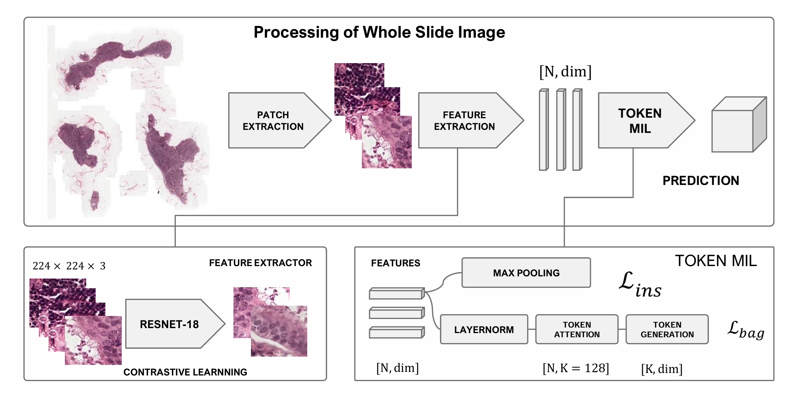
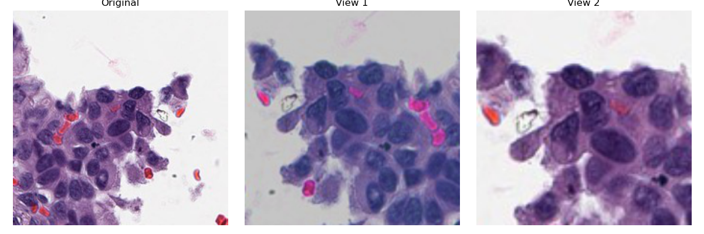

# TokenLearner-MIL

A novel token-based multiple instance learning framework for whole slide image classification.

## Overview

TokenLearner-MIL introduces a novel approach to whole slide image (WSI) classification by leveraging learned tokens to efficiently model hierarchical relationships in histopathological images. Our framework addresses the challenges of processing gigapixel resolution images and working with limited annotations through two key innovations:

1. An adaptive token learning mechanism that efficiently captures key tissue patterns
2. A contrastive learning strategy for robust feature extraction without detailed annotations

## Framework Architecture



The framework consists of three main components:
- **Feature Extraction**: Self-supervised contrastive learning for patch-level features
- **Token Learner**: Efficient instance aggregation through learned tokens
- **Classification Head**: Final prediction based on token representations

## Results

We evaluated our method on two distinct histopathology datasets:
- **Camelyon16** (400 WSIs, ~3.2M patches) for lymph node metastasis detection
- **BMIRDS** (84 WSIs, ~410K patches) for adenocarcinoma subtype classification

Our approach achieved:
- 95.5% accuracy on Camelyon16 (3% improvement over DSMIL)
- 87.4% accuracy on BMIRDS (16.4% improvement over DSMIL)

## Data Augmentation Examples



## Implementation Details

- **Feature Extractor**: ResNet-18 with instance normalization
- **Token Count**: 128 (optimal balance between accuracy and computational efficiency)
- **Training**: Adam optimizer, learning rate 0.0001, weight decay 1e-4

## Acknowledgments

This work builds upon the foundation of [DSMIL (Dual-Stream Multiple Instance Learning)](https://github.com/binli123/dsmil-wsi) by Li et al. We extend their contrastive learning approach while introducing our novel token-based aggregation mechanism.

## Citation

If you find this work useful, please cite our paper:
```
@article{anonymous2025tokenlearner,
  title={TokenLearner-MIL: A Novel Token-based Multiple Instance Learning Framework for Whole Slide Image Classification},
  author={Junze Huang, Meghdad Sabouri Rad,  Mohammad Mehdi Hosseini,
Rakesh Choudhary, Harmen Seizen, Tamara Jamaspishvili, Ola El-Zammar,
Saverio J. Carello, Michel Nasr, Bardia Yousefi Rodd},
  journal={Under Review},
  year={2025}
}
```
